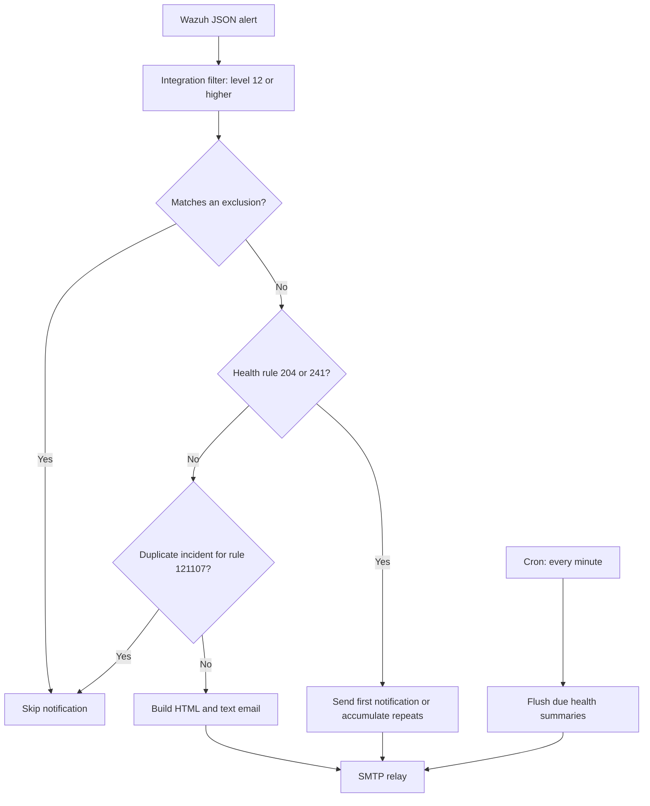

# Wazuh Pretty Email

[](LICENSE)
[](#requirements)

Readable email notifications for Wazuh: rich HTML alerts, direct event links, flexible exclusions, incident deduplication, and summaries of recurring health alerts.

Created by **[Hamronov](https://github.com/Hamronov)**. This is an independent community integration, not an official Wazuh component.

> **Transport:** trusted SMTP relay, without SMTP authentication or TLS in the current implementation. Email narratives and field labels are primarily Russian; this documentation is in English.

## Contents

- [Features](#features)
- [Email preview](#email-preview)
- [How it works](#how-it-works)
- [Requirements](#requirements)
- [Installation](#installation)
- [Configuration](#configuration)
- [Exclusions](#exclusions)
- [Deduplication and health summaries](#deduplication-and-health-summaries)
- [Validation and testing](#validation-and-testing)
- [Troubleshooting](#troubleshooting)
- [Security and privacy](#security-and-privacy)
- [Updates and removal](#updates-and-removal)
- [Repository layout](#repository-layout)
- [Compatibility and limitations](#compatibility-and-limitations)
- [Contributing](#contributing)
- [License and attribution](#license-and-attribution)
- [References](#references)

## Features

- Multipart email with HTML and plain-text alternatives.
- Severity-colored header, incident narrative, and structured event details.
- Host, user, process, parent process, file, network, hashes, and MITRE ATT&CK context when present in the alert.
- A direct Dashboard link using the alert ID, with a fallback query and a ±30-minute time window when a timestamp is available.
- Exclusions combining keywords, exact field values, and regular expressions.
- Targeted deduplication for rule `121107`.
- Immediate first notifications and scheduled repeat summaries for rules `204` and `241`.
- Python standard library only; no pip dependencies.

## Email preview

The repository includes a [sample HTML email](examples/email.html), its [plain-text version](examples/email.txt), and the [synthetic alert](examples/alert.json) used to generate them. Download the HTML file and open it in a browser; GitHub displays its source.

To regenerate the sample locally, without contacting SMTP or reading production configuration:

```bash
python3 tools/preview.py
```

Open `preview/email.html`. The helper uses only the bundled example configuration and disables its email-sending function. Linux or macOS is required because the imported integration uses `fcntl`.

## How it works



The script receives an alert file path from Wazuh Integrator. The supplied integration block selects alerts at level **12 and above**. This custom integration is separate from Wazuh's built-in email facility; `email_notification` does not enable or disable this script.

The health branches above are reachable only when those alerts pass the integration filter. The repository does not supply local rules that raise their severity.

## Requirements

| Component | Requirement |
| --- | --- |
| Runtime host | Linux Wazuh Manager; installation commands assume a systemd-based host |
| Python | Wazuh's Python interpreter at `/var/ossec/framework/python/bin/python3` |
| Account | Existing `wazuh` user and group |
| SMTP | Reachable, trusted relay accepting the configured sender and recipients without AUTH or TLS |
| Scheduler | Cron for timed health summaries; service is commonly `cron` or `crond` |
| Storage | `wazuh` can write state under `/var/ossec/var/run/` and the health log |
| Dashboard | Optional; event links assume the Data Explorer Discover route |

A cross-version Wazuh compatibility matrix has not been established. See [limitations](#compatibility-and-limitations).

## Installation

Run these commands **on the Wazuh Manager** from a checkout of this repository. They are a fresh-install recipe. For an existing installation, first back up the script, its two JSON configuration files, the cron entry, and `ossec.conf`; preserve local settings rather than replacing them with examples.

### 1. Download

```bash
git clone https://github.com/Hamronov/wazuh-pretty-email.git
cd wazuh-pretty-email
```

### 2. Install the script and configuration templates

```bash
sudo install -o root -g wazuh -m 750 \
  integrations/custom-pretty-email /var/ossec/integrations/custom-pretty-email
sudo install -o root -g wazuh -m 640 \
  config/custom_pretty_email.example.json /var/ossec/etc/custom_pretty_email.json
sudo install -o root -g wazuh -m 640 \
  config/custom_pretty_email_exclusions.example.json \
  /var/ossec/etc/custom_pretty_email_exclusions.json
sudoedit /var/ossec/etc/custom_pretty_email.json
```

Replace the example SMTP host, sender, recipient, and Dashboard URL before activation. The example exclusions file is an empty list; it suppresses nothing.

### 3. Register the integration

Add the following inside an existing `<ossec_config>` element in `/var/ossec/etc/ossec.conf`. Update an existing `custom-pretty-email` block instead of duplicating it.

```xml
<integration>
  <name>custom-pretty-email</name>
  <level>12</level>
  <alert_format>json</alert_format>
</integration>
```

Do not replace the complete Manager configuration with this fragment. Wazuh documents the integration name, alert format, filtering, and script placement in its [external integration guide](https://documentation.wazuh.com/current/user-manual/manager/integration-with-external-apis.html) and [configuration reference](https://documentation.wazuh.com/current/user-manual/reference/ossec-conf/integration.html).

### 4. Enable scheduled health summaries

Check the existing state directory without changing ownership of Wazuh's shared directories:

```bash
sudo -u wazuh test -w /var/ossec/var/run
sudo touch /var/ossec/logs/pretty-email-health.log
sudo chown wazuh:wazuh /var/ossec/logs/pretty-email-health.log
sudo chmod 640 /var/ossec/logs/pretty-email-health.log
sudo install -o root -g root -m 644 \
  cron/wazuh-pretty-email-health /etc/cron.d/wazuh-pretty-email-health
```

If the directory check fails, resolve the installation's permissions before continuing. The cron entry runs as `wazuh` every minute:

```cron
* * * * * wazuh /var/ossec/integrations/custom-pretty-email --flush-health >> /var/ossec/logs/pretty-email-health.log 2>&1
```

Check that your distribution's cron service is active. Schedule log rotation for `pretty-email-health.log` according to local retention policy.

### 5. Validate and activate

Check both JSON files before restarting:

```bash
sudo -u wazuh /var/ossec/framework/python/bin/python3 -m json.tool \
  /var/ossec/etc/custom_pretty_email.json > /dev/null
sudo -u wazuh /var/ossec/framework/python/bin/python3 -m json.tool \
  /var/ossec/etc/custom_pretty_email_exclusions.json > /dev/null
```

Validate the Manager configuration using the procedure appropriate to your installed Wazuh version, then restart in a maintenance window:

```bash
sudo systemctl restart wazuh-manager
sudo systemctl status wazuh-manager --no-pager
sudo tail -n 100 /var/ossec/logs/ossec.log
```

Installing the cron entry can flush existing pending summaries on an upgraded installation. Restarting the Manager affects alert processing; the commands above are deployment instructions, not part of the offline preview.

## Configuration

Active file: `/var/ossec/etc/custom_pretty_email.json`.

```json
{
  "smtp_host": "smtp.example.org",
  "smtp_port": 25,
  "from": "wazuh@example.org",
  "from_name": "Wazuh Security",
  "to": ["soc@example.org"],
  "subject_prefix": "[Wazuh]",
  "dashboard_url": "https://wazuh.example.org",
  "include_raw_json": false,
  "smtp_timeout": 20
}
```

| Key | Required / default | Meaning |
| --- | --- | --- |
| `smtp_host` | Required | SMTP relay hostname or address |
| `smtp_port` | `25` | SMTP port; changing it does not enable TLS |
| `from` | Required | Envelope and message sender address |
| `from_name` | Empty | Display name for the sender |
| `to` | At least one recipient | Use a JSON array of recipient addresses |
| `subject_prefix` | `[Wazuh]` | Prefix before severity, level, host, and incident title |
| `dashboard_url` | Empty | Dashboard base URL; empty disables event links |
| `include_raw_json` | `false` | Despite its name, includes `full_log`, not the entire alert JSON |
| `smtp_timeout` | `20` | SMTP connection/operation timeout in seconds |

Use JSON booleans (`true` / `false`), not strings. Keep `full_log` a string when enabling raw-log inclusion. Configuration is read on each invocation; changes to these JSON files do not require a Manager restart. Changes to `ossec.conf` do.

There are no implemented `smtp_user`, `smtp_password`, SSL, or STARTTLS settings. Adding those keys will not enable authentication or encryption.

## Exclusions

Active file: `/var/ossec/etc/custom_pretty_email_exclusions.json`.

```json
[
  {
    "name": "Example: approved maintenance event",
    "keywords": ["approved-maintenance-example"],
    "field_equals": {"rule.id": "100001"},
    "field_regex": {"agent.name": "test-host-[0-9]+"}
  }
]
```

This is a format example, not a recommended production suppression rule. A copy is available in [examples/exclusion.json](examples/exclusion.json).

Matching behavior:

- All keywords in one entry must match the flattened alert text, case-insensitively.
- All supplied exact-field and regex conditions must also match.
- Field paths use dot notation; exact comparisons are case-insensitive string comparisons.
- Regex matching is case-insensitive and covers the **entire field value** (`re.fullmatch`). Repeated Windows path separators are normalized first.
- The first matching entry suppresses the email and logs the exclusion name.
- A missing or empty `keywords` list disables an entry, even with field conditions. Use meaningful, nonblank keywords: blank-only entries can match more broadly than intended.

Keep the top-level value a JSON array. A missing or unreadable exclusions file falls back to no exclusions; malformed regex patterns can fail an invocation. Validate changes with synthetic alerts before deployment.

The public repository intentionally excludes the original infrastructure's 53 production exclusions.

## Deduplication and health summaries

These policies are constants in the script, not JSON settings.

| Rule | Policy | Identity |
| --- | --- | --- |
| `121107` | Suppress the same incident for 24 hours | Rule ID plus `targetUserName`, `resetActor`, and `resetTimestamp` parsed from `full_log` |
| `204` | First notification immediately; repeat summary after a 6-hour window | Rule ID and agent ID, falling back to agent name |
| `241` | First notification immediately; repeat summary after a 24-hour window | Rule ID and agent ID, falling back to agent name |
| Other rules | No deduplication or aggregation | Each eligible, nonexcluded alert is sent |

If required incident fields are absent, the `121107` deduplication is skipped. An SMTP exception releases its reservation; state errors fall back to sending the alert. This is not an exactly-once delivery guarantee.

Health summaries contain repeat counts and first/last timestamps. They explicitly state that recovery has **not** been confirmed. With no repeats, the expired entry is removed without a summary. Failed pending summaries remain for a later flush attempt; there is no general durable retry queue for all emails.

State files:

```text
/var/ossec/var/run/custom_pretty_email_dedup.json
/var/ossec/var/run/custom_pretty_email_health.json
/var/ossec/var/run/custom_pretty_email_health.json.lock
```

The integration filter still applies: low-level `204` or `241` alerts will not reach the script with the supplied level-12 threshold. Their local severity overrides and the custom detection rule `121107` are **not included**. Plan any filter changes deliberately; lowering the threshold can substantially increase email volume.

## Validation and testing

### Offline checks: no email

From the repository root:

```bash
python3 -c "import ast; from pathlib import Path; ast.parse(Path('integrations/custom-pretty-email').read_text(encoding='utf-8'))"
python3 tools/preview.py
```

The offline preview checks parsing and message rendering with synthetic data. It does not prove SMTP delivery, scheduling, filtering, or compatibility with every email client.

### Optional live SMTP test: sends an email

Only after configuring intended test recipients:

```bash
sudo install -o root -g wazuh -m 640 examples/alert.json \
  /var/ossec/tmp/pretty-email-test.json
sudo -u wazuh /var/ossec/integrations/custom-pretty-email \
  /var/ossec/tmp/pretty-email-test.json
sudo rm /var/ossec/tmp/pretty-email-test.json
```

Direct execution bypasses Wazuh's level filter but still applies script exclusions and repeat handling. Exit code zero may also mean suppression; SMTP acceptance is not proof of inbox delivery. Confirm receipt and verify a genuine eligible alert separately.

The integration executable itself has **no dry-run flag**. `--flush-health` can send pending summaries.

## Troubleshooting

| Symptom | Check |
| --- | --- |
| Alerts appear in Dashboard but no email arrives | Actual rule level, integration block, script permissions, exclusions, and repeat suppression |
| SMTP connection refused or timeout | Relay address, port, network access, and relay policy for the Manager |
| Relay requires login or STARTTLS | Current transport does not support them; use an appropriate trusted relay or implement the required transport |
| Script succeeds but the inbox is empty | Suppression messages, SMTP relay logs, quarantine, and recipient routing |
| Health summaries never arrive | Alert eligibility, pending repeats, cron service, writable state directory, and health log |
| Permission denied | Script `root:wazuh` / `750`, config `root:wazuh` / `640`, writable runtime state and health log |
| Event link opens the wrong page | Dashboard base URL, Data Explorer route support, event retention, and user access |
| An exclusion does not match | Nonempty keywords, exact dot paths, and full-value regex semantics |
| More messages after restart or upgrade | State retention, multiple Managers, duplicate integration blocks, or changed exclusions |

Useful logs:

```bash
sudo tail -n 100 /var/ossec/logs/ossec.log
sudo tail -n 100 /var/ossec/logs/integrations.log
sudo tail -n 100 /var/ossec/logs/pretty-email-health.log
```

The integrations log may not exist before activity; consult the Manager log as well.

## Security and privacy

Restrict relay access to authorized hosts and use this implementation only on a trusted SMTP path. The script transmits mail without TLS and does not authenticate to SMTP.

Alert emails may contain usernames, hostnames, IP addresses, commands, file paths, and raw logs. Use authorized recipients, restrict file access, and keep raw-log inclusion disabled unless required. Health state stores alert content, so protect it like other security logs.

Do not commit production configuration, exclusions, credentials, state files, or real alert samples. The supplied `.gitignore` covers common local paths but is not a substitute for reviewing a commit. HTML values are escaped by the renderer; that does not remove sensitive information from an alert.

## Updates and removal

For updates, back up the installed script and configuration, review changes, replace the script with the documented ownership and permissions, and preserve your JSON settings and state. Revalidate and test with intended recipients. Use a reviewed commit for reproducible deployments.

To disable the integration, remove its block from `ossec.conf`, remove its cron entry, and restart the Manager in a maintenance window. Archive configuration and state before deciding whether to delete them. Removing only the Manager integration leaves scheduled summary sending active while cron is still installed.

## Repository layout

```text
.
├── README.md
├── LICENSE
├── CONTRIBUTING.md
├── EXPORT.json
├── config/
│   ├── custom_pretty_email.example.json
│   ├── custom_pretty_email_exclusions.example.json
│   └── ossec-integration.xml
├── cron/
│   └── wazuh-pretty-email-health
├── examples/
│   ├── alert.json
│   ├── email.html
│   ├── email.txt
│   └── exclusion.json
├── integrations/
│   └── custom-pretty-email
└── tools/
    └── preview.py
```

## Compatibility and limitations

This initial publication preserves a deployed integration script exported on **2026-09-11**. Its source SHA-256 is recorded in [EXPORT.json](EXPORT.json). Public configuration values are examples; the integration executable is unchanged from that export.

Verified for this publication: Python syntax, JSON examples, and synthetic HTML/plain-text rendering. A fresh Manager installation, end-to-end email delivery, and cross-version/client compatibility were not tested as part of publication.

- Email labels and narratives are primarily Russian; localization is currently implemented in the source.
- HTML uses a fixed-width table layout; universal mobile responsiveness and email-client rendering are not guaranteed.
- Dashboard deep links depend on a specific route and may need adaptation for another version.
- State is local to one Manager; there is no cluster-wide deduplication.
- No general outbound queue, universal rate limit, or delivery receipts are implemented.
- No recovery detection is implemented by the repeat-summary mechanism.
- Detection rules, production exclusions, and the complete Manager configuration are outside this repository's scope.

## Contributing

Bug reports and pull requests are welcome. See [CONTRIBUTING.md](CONTRIBUTING.md) for the workflow and validation checklist. Use synthetic or carefully sanitized alerts when reporting a problem.

Contributions are voluntary. MIT does not require users to submit their changes upstream.

## License and attribution

Licensed under the [MIT License](LICENSE).

**Copyright (c) 2026 Hamronov.**

You may use, modify, and distribute this integration, including commercially, under the license terms. Retain the copyright and permission notice in copies or substantial portions of the software. A visible credit or link to this repository is appreciated, but MIT does not require attribution in your interface or outgoing emails.

## References

- [Wazuh: external API integration](https://documentation.wazuh.com/current/user-manual/manager/integration-with-external-apis.html)
- [Wazuh: integration configuration](https://documentation.wazuh.com/current/user-manual/reference/ossec-conf/integration.html)
- [Python: smtplib](https://docs.python.org/3/library/smtplib.html)
- [Issues](https://github.com/Hamronov/wazuh-pretty-email/issues)
- [Pull requests](https://github.com/Hamronov/wazuh-pretty-email/pulls)

[Back to top](#wazuh-pretty-email)
